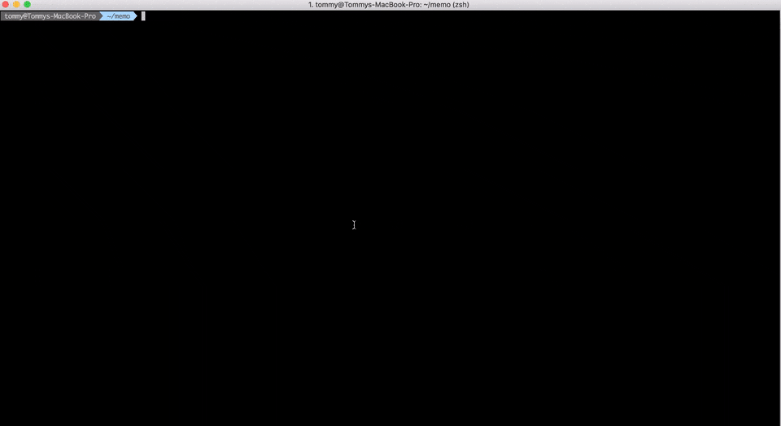

# php-metrics-monitor

The metrics-monitor is a simple tool to visualize metrics across various projects.
So you can see the trend on one monitor.

At the time it can visualize the the following metrics:

* (Line-)Coverage 
* to be continued ...

Further metrics are planned. Please look at the [roadmap](#roadmap).

## Demo



## <a name="install"></a> Install

### As Phar (Recommended)

You can install the monitor with these two simple commands:

```
$ curl -LSs https://github.com/tommy-muehle/php-metrics-monitor/releases/download/1.0.0/memo.phar
$ chmod +x memo.phar
```

### From source

If you want to build up from source do the following:

```
$ git clone https://github.com/tommy-muehle/php-metrics-monitor.git
$ cd php-metrics-monitor
$ composer install
```

After these steps you can play with memo:
 
```
$ php ./bin/memo
``` 

To build your own [phar](http://php.net/manual/en/book.phar.php) do this in the project directory:

```
$ curl -LSs https://box-project.github.io/box2/installer.php | php
$ php box.phar build
```

Now you can found your own phar in the [build](build) directory.

## <a name="usage"></a> Usage

### Add entries

To add entries for further visualization run the following command:

```
$ php memo.phar add path/to/coverage.xml --slug=MYPROJ
```

The Slug option is optional. The default are "GENERAL".

This task can also automatically done by a CI system such as Jenkins. Please look at the 
[wiki page](https://github.com/tommy-muehle/php-metrics-monitor/wiki/Integration-in-CI-system) to see integration examples.

### Show diagrams

To see visualize the results simple run the following command:

```
$ php memo.phar run
```

After this you can access the GUI via browser. 
By default the address are *http://localhost:8000*.

## <a name="security"></a> Security

You can download [Tommy's](https://github.com/tommy-muehle) public key and verify the 
signature (memo.phar.sig) of the memo.phar.

```
$ gpg --keyserver hkp://pgp.mit.edu --recv-keys 9BA742C3
$ gpg --verify memo.phar.sig memo.phar
```

## <a name="roadmap"></a> Roadmap

### [1.1.0] (Mid-July)

- Add complexity as second diagram option 
- Refactor javascript parts

## Changelog

### [1.0.0]

- Initial release with coverage diagram option

## <a name="contribute"></a> Contributing

Please refer to [CONTRIBUTING.md](CONTRIBUTING.md) for information on how to contribute.
